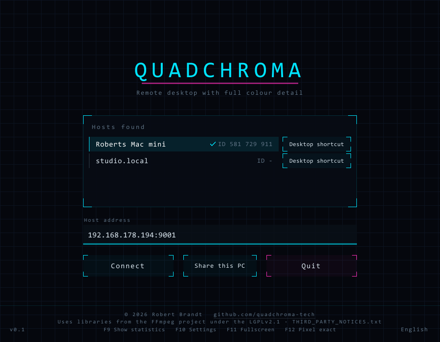

# QuadChroma

Remote desktop with full colour resolution. The Mac captures its screen, encodes it
in hardware as HEVC 4:4:4 with 10 bits per sample and sends it to a Windows PC. The
mouse pointer is deliberately *not* rendered into the video: what you see is the
Windows pointer, and the Mac follows it invisibly, so the mouse feels local. To make
it still look like the Mac's pointer, the host sends only the pointer *shape* (arrow,
hand, resize arrows, text cursor, wait cursor) whenever it changes.

Status as of 26 September 2026: it runs, but it is still a scaffold, not a finished
application. Releases: see the Releases page once published. The macOS host will ship
as a DMG and as a ZIP; unpack the ZIP with the Finder or `ditto -x -k` (it contains no
AppleDouble `._*` entries, so the command-line `unzip` works as well).

This file is an English overview. The complete documentation is in German,
`README.md` and `BENUTZUNG.txt` (every switch, log line and protocol message), and
it is authoritative where this overview differs.

## Why 4:4:4

Common remote-desktop tools transmit colour at half the width and half the height of
the picture. At 1080p the chroma ends up at 960×540, and red edges visibly fray.
QuadChroma transmits a separate colour value for every pixel. Apple's Media Engine can
do this in hardware, but FFmpeg does not expose these profiles, so the host drives the
encoder directly through VideoToolbox.

## Design in brief

- One program per side: `QuadChroma.app` on the Mac, `quadchroma.exe` on Windows. The
  same exe can also act as a host (`--host`); the same Rust source builds a Mac client.
- Pointer on the client side: the client shows its own local pointer in the shape the
  host reports; the video never contains one.
- Always encrypted: Noise XX with X25519, ChaCha20-Poly1305 and SHA-256, no switch to
  turn it off.
- Pairing with fingerprints: both sides keep a permanent key, a host accepts a new
  device only when started with `--pair` (the very first one automatically), both
  sides show a six-digit comparison code, and the client refuses a host whose key has
  changed.
- The host does nothing without a viewer: no capture, no encoder, 0.6 % CPU load when
  idle; capture and encoder appear when someone connects and go when the viewer leaves.

## Platforms and status

| Side | Platform | State |
|---|---|---|
| Host | Mac (developed and measured on a Mac mini M1), macOS 14 or later; Objective-C and C | Main role. HEVC 4:4:4 and 4:2:0 in 8 and 10 bit and H.264, all in hardware and switchable while running; audio; clipboard including files; choice of the streamed display. |
| Client | Windows 10 or 11, 64-bit; Rust | Main role. NVDEC, D3D11VA or software decoding; Direct3D 11 display; notification-area icon, single instance, desktop shortcut per host. |
| Host role | Windows, the same `quadchroma.exe` with `--host` | Secondary. Capture via Desktop Duplication, encoder via NVENC on NVIDIA; without NVIDIA only H.264 in software via Media Foundation, which holds back 16 frames and is enough to test the chain but not for real use. Missing: AMF/QSV, HDR outputs, scaling and rotation on the GPU (both run on the CPU today), a menu entry to share this computer. Not yet verified on real NVIDIA hardware. |
| Client | Mac (arm64), the same Rust source | Secondary, under construction. Audio via AudioToolbox, clipboard including files via NSPasteboard, display on the CPU (no Metal yet), menu-bar icon, no desktop shortcut. Not distributed as a binary, see License. |

Signing: today the Mac bundle is signed with a local development certificate only and
the Windows executable is not signed. Developer ID signing with notarization for the
Mac host and a signature for the exe are on the list of open points.

## Requirements

- Mac host: macOS 14 or later. Two permissions in System Settings > Privacy &
  Security: Screen Recording (for the picture) and Accessibility (for mouse and
  keyboard).
- Windows client: Windows 10 or 11, 64-bit. `quadchroma.exe` with two FFmpeg DLLs
  next to it: `avcodec-63.dll` and `avutil-61.dll`.
  No Visual C++ runtime is needed: the C runtime is linked into the exe, and the DLLs
  use only the Universal C Runtime that is part of Windows 10 and 11. Direct3D, DXGI
  and `d3dcompiler_47.dll` are parts of Windows; none of them is shipped.
- Hardware decoding on Windows: NVDEC on NVIDIA; D3D11VA on AMD and Intel, which in
  FFmpeg 9 handles only HEVC 4:2:0 and H.264 (4:4:4 is decoded in software).
- Network: three ports on the host. 9001 carries video and audio (everything from
  host to client), 9002 input and clipboard including files (everything from client
  to host), 9003 the announcement. The host announces itself every two seconds on the
  local network. On its first start the Windows Firewall asks whether the program may
  use the network; allow it, otherwise the host list stays empty.

## Getting started

### Mac host

    make
    open -n build/QuadChroma.app --args --serve 9001 --fps 120 --mbit 50 --fest

On the first start grant the two permissions listed above. `make` signs the bundle
with a local development certificate so that the Screen Recording permission survives
a rebuild. The host captures its main display; the client can choose another one, and
`--display n` pins list entry `n` (see `--list`) for this run. `--fest` keeps the rate
of `--fps` even when the screen is still; without it frames go out only on changes.
`--mbit` is a cap the encoder does use: 150 Mbit/s means 150 Mbit/s with motion, so
outside your own network 25 to 50 is the better choice. Log: `/tmp/quadchroma-m1.log`
(moved to `.alt.log` above 8 MB). Keys and lists: `~/Library/Application
Support/QuadChroma/` (`host.key`, `authorized.txt`, `bildschirm.txt`).

### Windows client

    quadchroma.exe
    quadchroma.exe 192.168.178.194:9001

Without an address the start screen opens; the Mac appears in the list after a few
seconds, and a click connects. Closing the window does not quit: the client goes to
the notification area, whose icon brings the window back, connects to a found host or
quits (`tray=aus` in `einstellungen.txt` restores close-to-quit). Only one client
with a window runs per user session; a second start hands its address to it and exits.

A desktop shortcut per host is created with the button in each host row of the start
screen or in the Encryption tab of the menu. It is named `QuadChroma - <name>.lnk`,
carries the full path of the exe and the host's address, and a double-click connects
at once, even when the client already sits in the notification area. Without a
window: `quadchroma.exe --verknuepfung <address> [--name <name>] [--ordner <dir>]`.
The exe carries no icon; the client draws its own (four coloured squares) and writes
`%APPDATA%\QuadChroma\quadchroma.ico` for the shortcut.

The client's files live in `%APPDATA%\QuadChroma\`: `client.key`, `known_hosts.txt`,
`einstellungen.txt`, `protokoll.txt` (the log, restarted at every start), `benchmark.txt`.

### Pairing

While the host has no authorisation list (`authorized.txt`) it accepts the first
device that connects; after that every new device needs a host started with `--pair`:

    open -n build/QuadChroma.app --args --serve 9001 --pair

The host log then shows a six-digit comparison code such as "628 306"; the client
shows the same code with F9. If both match, nobody is in between; if not, disconnect.
The client stores the host's fingerprint per address in `known_hosts.txt` and checks
it during the handshake before identifying itself; if it has changed, the client
stops and does not retry until you delete that entry by hand. A host under a new
address is a first contact, even under a known name, so compare the code again. A key
or list file that exists but is unreadable or damaged never counts as a first start:
the side refuses instead of pairing anew. `--forget` deletes all authorisations.

One viewer at a time: another paired device that connects takes over the session; the
previous one shows "Another device has taken over the session." and does not reconnect.

## Using the client

| Key | Effect |
|---|---|
| F9 | statistics on and off |
| F10, or hold ESC for two seconds | menu: Picture, Display, Encryption, Shortcuts, Benchmark |
| F11 | full screen on and off |
| F12 | pixel-exact rendering instead of scaled |
| Ctrl+Esc | back to the start screen |

Every key function is also a switch in the menu. All other keys go to the Mac. What
travels is the key's position, not the character, so umlauts, accents and AltGr work
without any mapping; the Windows key is the Mac's Command key. While the menu is
open, mouse and keyboard belong to the menu, not to the Mac.

**Menu.** Picture: bit rate, frame rate, game mode, fixed frame rate, audio, the
host's display and the codec. Display: full screen, pixel-exact, statistics, nerd
mode (the latency chain as a bar on a fixed millisecond scale: capture and waiting,
encoder, network, decoder, display), which statistics lines, and on machines with two
GPUs one row each for the display and for the decoder with the roles Automatic,
Graphics card, Integrated and Processor (only roles that have a card are shown; the
decoder switches at once, the display from the next start). Encryption: method,
comparison code, fingerprint, disconnect, desktop shortcut. Shortcuts: every key the
client intercepts. Benchmark: see below. Hovering over a switch shows a one-sentence
explanation. The host applies a change immediately and reports back what is actually
in effect; the client stores the values per host (by fingerprint) and restores them
on the next connection.

**Host display.** The host streams exactly one display. In the Picture tab, above the
codec buttons, there is an Automatic button and one per display of the host with
name, size and refresh rate. Automatic (default) follows the host's main display,
also when it changes, without restart. A fixed choice is remembered by a stable
identifier, not by list position; if that display is unplugged, the host falls back
to the main display, says so in amber, and returns by itself when the display comes
back. The choice is stored on the host in `bildschirm.txt`.

**Codecs.** The Picture tab lists what the host's encoder really supports; on the M1
that is HEVC in 4:4:4 and 4:2:0, each in 8 and 10 bit, and H.264. Switching happens
while running, the picture stands still for a blink; two modes are marked "with
conversion" because the capture has no 8-bit 4:4:4. AV1 is not offered yet.

**Files via the clipboard.** Copy files or folders in Explorer or Finder and paste
them on the other side, in both directions, between the client (Windows or Mac) and
either host. Unlike RDP, the transfer starts when you copy, not when you paste: the
other side writes the files into its own directory in the temp folder
(`QuadChroma-Ablage`, on the hosts `QuadChroma-Host-Ablage`) and puts them into its
clipboard as a file list once everything has arrived; the three newest transfers are
kept. A thin line at the bottom of the picture shows progress. Limits: 4 GB and
10,000 entries per copy, the entry list up to 1 MiB. Files rank behind video, audio
and input; new clipboard content, the end of the session and 30 s without progress
abort a transfer, and half-received data is deleted. The receiver checks paths,
lengths and order as if they were hostile; links are neither sent nor created. Text
is transferred too (up to 4 MB). Entries a program marks as concealed, as password
managers do, stay where they were copied; received content is kept out of clipboard
history and cloud clipboards, and nothing is read without a connected counterpart.

**Benchmark.** The Benchmark tab runs codecs, frame rates and bit rates in sequence,
3 to 15 seconds per step, without stopping the picture: arrived frame rate, the whole
chain in milliseconds, dropped frames, the host's encoder time against its budget,
CPU load on both sides. A step passes when at least 95 % of the target frame rate
arrives, under 1 % is dropped and the chain is at most 30 ms. On request the host
sends a fixed moving test pattern so that every step sees the same content. At the
end a recommendation can be applied with one click; the table is written to
`benchmark.txt`. Headless: `quadchroma.exe <address> --headless --benchmark 5`.

**Test mode.** `quadchroma.exe <address> --headless` runs without a window and prints
a status line every three seconds; `--decodertest` tries every decoder choice without
a connection, `--anzeigetest <dir>` checks the GPU display path against the CPU path,
`--shot` writes a BMP of the interface. `BENUTZUNG.txt` lists all switches.

## Measurements

Measured on a Mac mini M1 as host, 1920×1080, as given in `README.md`:

| | |
|---|---|
| Picture | 1920×1080, 4:4:4, 10 bit, 120 frames/s target; the host caps at that rate |
| Video bit rate | 3 to 11 Mbit/s with a still picture, up to the configured cap with motion |
| Encoder | hardware, about 8 ms per frame, a few percent of one core |
| Codecs | HEVC 4:4:4 and 4:2:0 in 8 and 10 bit, H.264, all in hardware, switchable while running |
| Decoding on Windows | NVDEC in hardware; D3D11VA on AMD and Intel (4:2:0 and H.264); software 8.6 ms per frame, slice-parallel so that no frame is held back |
| Display on Windows | Direct3D 11: raw decoder planes go to the GPU, conversion and scaling in shaders, bit-identical to the CPU path |
| Latency | 15 to 20 ms from capture to hand-over to the display, measured with per-frame timestamps |
| Audio | uncompressed, stereo, 48 kHz, about 3 Mbit/s; can be switched off |

File transfer, from the integration tests of the same state: on the build VM
(software encoder, no GPU) about 30 MB/s from client to host, with about 2 frames/s
less and around 60 ms more encoder delay, cause not yet explained; 69 to 93 MB/s from
host to client without measurable effect on the picture. In the LAN from the Windows
client to the Mac host, 28 MB/s at an unchanged 114 frames/s and 30 to 37 ms delay.
The Windows host role has been verified on the VM and in the test harnesses only.

## Security

Every connection is encrypted and mutually authenticated: Noise XX with X25519,
ChaCha20-Poly1305 and SHA-256, permanent keys on both sides, fresh session keys per
connection, and a six-digit comparison code derived from the handshake. The video
channel is set up first; the input channel includes the video channel's handshake
hash in its own handshake, so nobody can take over the keyboard without first having
set up the video channel legitimately, and the client checks that the input
channel's peer is the same host as the video channel's. The host binds the input
channel to one viewer and releases that viewer's pressed keys and mouse buttons when
it is replaced or its picture breaks off. Handshakes have an overall deadline (host
5 s, client 3 s), are limited to 32 at a time per port and a few per sender, and
anything anyone on the network can trigger without pairing is logged with rate
limiting; both hosts cap their log at 8 MB. On the Mac the pattern is implemented in
about 400 lines of C on Monocypher, on Windows with the established Rust
implementation; the two were checked against each other.

Known limitation: pairing is tied to the address. `known_hosts.txt` remembers the key
per address and the network announcement is not authenticated, so a different device
under a known name at a new address counts as a first contact, and then only the
comparison code protects you. The clipboard is read during a session even when the
client window has no focus. Report vulnerabilities as described in `SECURITY.md`.

## Building from source

### Windows client and host role

Rust with the MSVC toolchain, LLVM (for bindgen) and the FFmpeg libraries built by
`scripts/build-ffmpeg-windows.sh`: a minimal LGPL build of FFmpeg 9.0.2 without any
external library, cross-compiled with MinGW-w64 on macOS (Homebrew: `mingw-w64`,
`nasm`, `pkgconf`) or Linux (`mingw-w64`, `nasm`, `make`, `pkg-config`). The script
downloads the FFmpeg release and the NVIDIA codec headers, checks their SHA-256 and
writes the result (DLLs, headers, import libraries) to the folder given as argument:

    scripts/build-ffmpeg-windows.sh ffmpeg-windows

Copy that folder to the Windows machine and point `FFMPEG_DIR` to it:

    set FFMPEG_DIR=C:\path\to\ffmpeg-windows
    set LIBCLANG_PATH=C:\Program Files\LLVM\bin
    cd client
    cargo build --release

Build from `client\`: only there does `client\.cargo\config.toml` apply, which links
the C runtime statically into the exe (otherwise it would need `VCRUNTIME140.dll`
from the Visual C++ Redistributable); a `RUSTFLAGS` environment variable replaces
that setting silently, so the build aborts with a hint if the static runtime is
missing. Put the two DLLs named under Requirements (from `ffmpeg-windows\bin`) next
to the exe. Tests:
`cargo test --release` in `client\` with FFmpeg's `bin` folder in `PATH`; several
tests need loopback TCP, and the clipboard tests use the session's real clipboard.

### Mac host

The Xcode Command Line Tools are enough; a full Xcode installation is not required.
`make` builds `build/QuadChroma.app` from `host/` and signs it with the local
development identity named in the Makefile. The host uses only its own code, Apple
frameworks (Foundation, AppKit, ScreenCaptureKit, VideoToolbox, CoreMedia, CoreVideo,
CoreGraphics, CoreFoundation, IOKit) and the vendored Monocypher; no FFmpeg. Test
harnesses that run without screen capture (`annahmetest`, `hosttest`, `dateitest`,
`ablagetest`, `noisetest`) are described in `README.md` with their `clang` lines.

### Mac client

    cd client
    FFMPEG_DIR=/opt/homebrew/opt/ffmpeg cargo build --release
    ./target/release/quadchroma 192.168.178.194:9001

Licence note: the FFmpeg from Homebrew is a GPL build (libx264, libx265). That is
fine for your own use, but passing on a Mac client built this way would require an
LGPL build without the GPL parts. This is why no Mac client binary is distributed.
Tests: `cargo test --release -- --skip clipboard` in `client/`, because one clipboard
test otherwise reads and writes the real clipboard.

## Repository layout

    host/          Mac host (Objective-C and C): capture, encoder, network, input,
                   audio, clipboard, files, display selection, pointer shape;
                   host/vendor/monocypher is the vendored Monocypher
    client/        Rust: receive, decode, display (anzeige.rs: Direct3D 11), input,
                   audio, clipboard, files and display list (shared with the host
                   role), notification area and menu bar, single instance, desktop
                   shortcut, icon; the Windows host role in client/src/host/
    Makefile       builds and signs the Mac app bundle
    README.md      full documentation, German
    BENUTZUNG.txt  usage reference for client and Windows host role, German
    *.png          screenshots used by the documentation
    LICENSE.md, THIRD_PARTY_NOTICES.md, CLA.md, CONTRIBUTING.md, SECURITY.md,
    CODE_OF_CONDUCT.md   licence and community files, see below

Code comments are in German.

## What is missing

The full list is in `README.md`. The main points: verification on real hardware (the
Windows host role with an NVIDIA card, Windows scaling and rotated outputs, a real
audio device, the congestion rule on a genuinely slow link); a pairing dialog in the
interface; files transferred on paste instead of on copy; AV1; optional audio
compression; several viewers at once; stream size chosen by the client; Developer ID
signing and notarization for the Mac host and a signature for the Windows exe.

## License

QuadChroma is source-available, not open source. The project is licensed under the
**PolyForm Strict License 1.0.0**, reproduced unchanged in `LICENSE.md`, together
with **Additional Terms of the licensor** in the same file. In short:

- You may use QuadChroma for personal, noncommercial purposes.
- You may not distribute it, modify it or create works based on it.
- You may not embed or build it, its code or its protocol into other products,
  devices, services or libraries, and you may not offer it as a service.
- Any commercial or business use, including purely internal use within a company,
  requires a separate licence from the licensor.

This summary is for orientation only and has no legal effect; `LICENSE.md` is the
binding text. Commercial licences and other permissions are available on request:
hello@quadchroma.tech.

Third-party components: this software uses libraries from the FFmpeg project under
the LGPLv2.1. The Windows client loads them as separate DLLs (`avcodec-63.dll`,
`avutil-61.dll`), built unmodified from FFmpeg 9.0.2 without any external library by
`scripts/build-ffmpeg-windows.sh`; the exe contains no FFmpeg code, and the DLLs can
be replaced by another build of the same FFmpeg version. The FFmpeg source is attached
to every release that contains the Windows package and available at https://ffmpeg.org.
The Mac host contains Monocypher (BSD-2-Clause OR CC0-1.0). The licences of these
components and of the Rust crates per target, together with the FFmpeg build details,
the source references and a written offer, are collected in `THIRD_PARTY_NOTICES.md`.

Contributions are accepted only under the Contributor License Agreement in `CLA.md`,
which lets the licensor offer the project under other terms as well; see
`CONTRIBUTING.md`. Security reports: `SECURITY.md`. Conduct: `CODE_OF_CONDUCT.md`.

Copyright 2026 Robert Brandt. Contact: hello@quadchroma.tech, https://quadchroma.tech.
