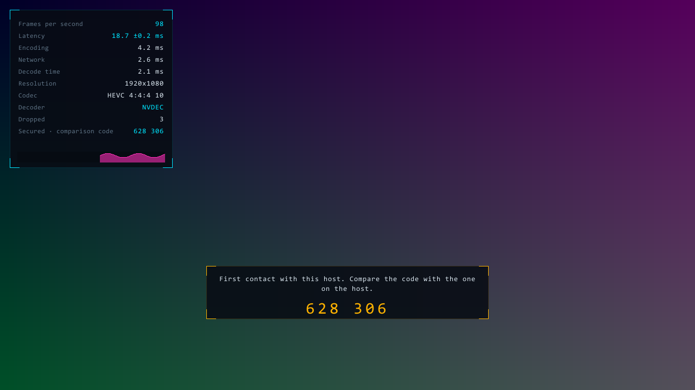
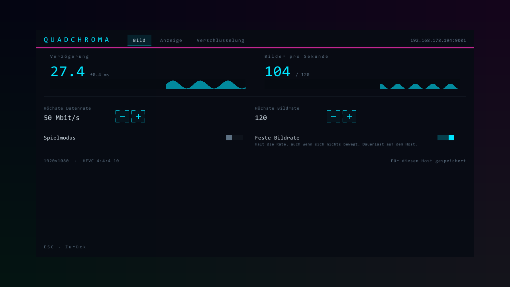

# QuadChroma

**Your Mac on a Windows screen, pixel-sharp: HEVC 4:4:4 with 10 bits, encoded by the
Mac's hardware and decoded on any Windows 10 or 11 PC - in hardware by an NVIDIA GPU,
otherwise in software. Free for personal use.**

As far as we know, QuadChroma is the only free remote desktop that streams a Mac to a
Windows PC in 4:4:4 at 10 bits with the Mac's hardware encoder, the Media Engine of
Apple silicon (comparison below). Every Windows 10 or 11 PC can show that stream. An
NVIDIA GPU decodes it in hardware (NVDEC); on AMD or Intel graphics, or without a
suitable GPU, the PC decodes 4:4:4 in software, in about 8.6 ms per 1080p frame and
slice-parallel. AMD and Intel GPUs decode HEVC 4:2:0 and H.264 in hardware (D3D11VA),
and the codec can be switched while the session runs.

- **Sharp text, clean color edges.** 4:4:4 keeps a color value for every pixel;
  the usual 4:2:0 shares one between four, which makes red text and thin coloured
  lines fray. 10 bits per sample instead of 8 remove banding in gradients.
- **The pointer is yours.** It is never part of the video: Windows draws its own
  pointer in the shape the Mac reports, so the mouse feels local even when the
  picture is a few milliseconds behind.
- **Latency you can see.** 15 to 20 ms from capture on a Mac mini M1 to hand-over to
  the display at 1080p and 120 frames/s in the LAN (about 24 ms when the PC decodes
  4:4:4 in software); the statistics panel shows every link of the chain live
  (encoder, network, decoder), and a built-in benchmark recommends codec, bit rate
  and frame rate for your network.
- **One program per side, nothing else.** No account, no cloud, no relay server, no
  extra driver or helper service: `QuadChroma.app` on the Mac, `quadchroma.exe` on
  Windows, connected directly in your network (or through your VPN). Always
  encrypted (Noise protocol). A new device gets in with the host's access
  password or a click on "Allow" at the host - no command-line switches.
- **Everyday comfort.** Copy files between Mac and PC through the clipboard, like
  with Windows Remote Desktop; choose which of the Mac's screens to show (it follows
  the main screen automatically); audio; a desktop shortcut per host; 29 languages.


## How it compares

Streaming *from a Mac* in 4:4:4, checked on 26 September 2026 from the vendors'
documentation and source code:

| | 4:4:4 from a Mac host | 10 bit | Encoding on the Mac | Cost |
|---|---|---|---|---|
| **QuadChroma** | yes | yes | hardware (VideoToolbox, HEVC) | free for personal use |
| Jump Desktop (Fluid) | yes | only "Ultra" mode | not stated | paid app; 10-bit 4:4:4 only in Jump Desktop for Teams Enterprise |
| Parsec | no - "Prefer 4:4:4 color" needs a host with NVIDIA or Intel H.265 4:4:4 encoding | - | - | 4:4:4 only in Teams and Warp |
| Sunshine + Moonlight | only with the software encoder (the VideoToolbox encoder has no 4:4:4) | not documented for this path | software | free |
| Splashtop | no - 4:4:4 on Windows streamers only | - | - | paid |
| RustDesk | yes, VP9/AV1 4:4:4 | not documented | software | free |

Sources: [Jump Desktop Fluid 2.0](https://changelog.jumpdesktop.com/fluid-2.0-beta-2-studio-quality-remote-desktop-with-4-4-4-and-10-bit-color-1IKhva),
[Jump Desktop 10](https://docs.jumpdesktop.com/whats-new/jump-desktop-10/),
[Parsec: stream quality and color accuracy](https://support.parsec.app/hc/en-us/articles/32381785123860-Improve-Stream-Quality-and-Color-Accuracy),
[Sunshine `src/video.cpp`](https://github.com/LizardByte/Sunshine/blob/master/src/video.cpp) (encoder flags),
[Splashtop performance options](https://support-splashtopbusiness.splashtop.com/hc/en-us/articles/6193537936027-Performance-Options),
[RustDesk discussion #8128](https://github.com/rustdesk/rustdesk/discussions/8128).
Products change; corrections are welcome as an issue.

## How it works

Remote desktop with full color resolution. The Mac captures its screen, encodes it
in hardware as HEVC 4:4:4 with 10 bits per sample and sends it to a Windows PC. The
mouse pointer is deliberately *not* rendered into the video: what you see is the
Windows pointer, and the Mac follows it invisibly, so the mouse feels local. To make
it still look like the Mac's pointer, the host sends only the pointer *shape* (arrow,
hand, resize arrows, text cursor, spinning wait cursor) whenever it changes.

Status as of 26 September 2026: it runs, but it is still a scaffold, not a finished
application. Releases: see the Releases page once published. The macOS host will ship
as a DMG and as a ZIP; unpack the ZIP with the Finder or `ditto -x -k` (it contains no
AppleDouble `._*` entries, so the command-line `unzip` works as well).

This README is the overview. `MANUAL.txt` is the complete manual: every switch, log
line and protocol message. Code comments and the program's log lines are in German;
where this README quotes a log line, it keeps the German original and explains it.

## Why 4:4:4

Common remote-desktop tools transmit color at half the width and half the height of
the picture. At 1080p the chroma ends up at 960×540, and red edges visibly fray.
QuadChroma transmits a separate color value for every pixel. Apple's Media Engine can
do this in hardware, but FFmpeg does not expose these profiles, so the host drives the
encoder directly through VideoToolbox.

## Decoding on Windows

Every Windows 10 or 11 PC can show every codec the host offers, including HEVC 4:4:4
with 10 bits. Which decoder does the work depends on the graphics hardware:

| Graphics in the PC | HEVC 4:4:4 | HEVC 4:2:0 and H.264 |
|---|---|---|
| NVIDIA | hardware (NVDEC) | hardware (NVDEC) |
| AMD or Intel | software | hardware (D3D11VA) |
| no suitable GPU | software | software |

The default choice, Automatic, takes NVDEC when an NVIDIA card is present, otherwise
D3D11VA on the card that draws the picture, otherwise software. D3D11VA in FFmpeg 9
handles only HEVC 4:2:0 and H.264; with a 4:4:4 codec the client says so and decodes
in software, and the codec can be changed in the Picture tab of the menu. A hardware
decoder that accepts data but delivers no picture, or only unreadable ones, for 1.5 s
is replaced by software automatically; the reason appears in the statistics and in
the log. The Display tab lets you pick the decoder yourself (Automatic, Graphics card,
Integrated, Processor), effective immediately; on the command line
`--decoder auto|gpu|gpu2|integriert|software`.

The software decoder needs about 8.6 ms per 1080p frame for HEVC 4:4:4 at 10 bits and
works slice-parallel, so that no frame is held back. Measured over the network at
1080p with a target of 120 frames/s:

| Codec, software decoder | Latency | Decoder |
|---|---|---|
| HEVC 4:4:4 10 bit | about 24 ms | 8.6 ms |
| HEVC 4:2:0 8 bit | about 19 ms | 6.8 ms |
| H.264 High | about 33 ms | 15.0 ms |

Drawing is separate from decoding: with a graphics card the client draws with
Direct3D 11, whichever decoder runs. The raw decoder planes go to the GPU, and color
conversion and scaling run there in shaders, bit-identical to the CPU path; without a
graphics card the CPU draws.

## Design in brief

- One program per side: `QuadChroma.app` on the Mac, `quadchroma.exe` on Windows. The
  same exe can also act as a host (`--host`); the same Rust source builds a Mac client.
- Pointer on the client side: the client shows its own local pointer in the shape the
  host reports; the video never contains one.
- Always encrypted: Noise XX with X25519, ChaCha20-Poly1305 and SHA-256, no switch to
  turn it off.
- Access by password or click: every device has a permanent key and a nine-digit
  device ID derived from it. A host lets a new device in when it proves the host's
  access password - the password itself never crosses the network - or when someone
  at the host clicks "Allow"; after that it knows the device by its key. The client
  remembers every host that let it in by its key as well, whatever address it has.
- The host does nothing without a viewer: no capture, no encoder, 0.6 % CPU load when
  idle; capture and encoder appear when someone connects and go when the viewer leaves.

## Platforms and status

| Side | Platform | State |
|---|---|---|
| Host | Mac (developed and measured on a Mac mini M1), macOS 14 or later; Objective-C and C | Main role. HEVC 4:4:4 and 4:2:0 in 8 and 10 bit and H.264, all in hardware and switchable while running; audio; clipboard including files; choice of the streamed screen; menu-bar icon with device ID, access password, allowed devices and "Start at login". |
| Client | Windows 10 or 11, 64-bit; Rust | Main role. NVDEC, D3D11VA or software decoding; Direct3D 11 display; notification-area icon, single instance, desktop shortcut per host. |
| Host role | Windows, the same `quadchroma.exe`, started with "Share this PC" on the start screen (or `--host`) | Secondary. Capture via Desktop Duplication, encoder via NVENC on NVIDIA; without NVIDIA only H.264 in software via Media Foundation, which holds back 16 frames and is enough to test the chain but not for real use. Icon in the notification area with device ID, access password, allowed devices and "Start with Windows". Missing: AMF/QSV, HDR outputs, scaling and rotation on the GPU (both run on the CPU today). Not yet verified on real NVIDIA hardware. |
| Client | Mac (arm64), the same Rust source | Secondary, under construction. Audio via AudioToolbox, clipboard including files via NSPasteboard, display on the CPU (no Metal yet), menu-bar icon, no desktop shortcut. Not distributed as a binary, see "Building from source". |

Signing: the project does not pay for certificates yet. Mac releases are signed with
the project's own free certificate "QuadChroma Release" (permissions survive updates,
but macOS asks once before the first start), the Windows executable is unsigned; see
"First start of a downloaded release". `RELEASING.md` describes the paid route (Apple
Developer ID with notarisation, a Windows code-signing certificate) for later.

## Requirements

- Mac host: macOS 14 or later. Two permissions in System Settings > Privacy &
  Security: Screen Recording (for the picture) and Accessibility (for mouse and
  keyboard).
- Windows client: Windows 10 or 11, 64-bit, with any graphics hardware (see
  "Decoding on Windows"). `quadchroma.exe` with two FFmpeg DLLs next to it:
  `avcodec-63.dll` and `avutil-61.dll`.
  No Visual C++ runtime is needed: the C runtime is linked into the exe, and the DLLs
  use only the Universal C Runtime that is part of Windows 10 and 11. Direct3D, DXGI
  and `d3dcompiler_47.dll` are parts of Windows; none of them is shipped.
- Network: three ports on the host. 9001 carries video and audio (everything from
  host to client), 9002 input and clipboard including files (everything from client
  to host), 9003 the announcement. The host announces itself every two seconds on the
  local network. On its first start the Windows Firewall asks whether the program may
  use the network; allow it, otherwise the host list stays empty.

## First start of a downloaded release

QuadChroma is not signed with a paid certificate (Apple Developer Program, Windows
code-signing certificate), so Windows and macOS ask once before the first start.
Download only from the project's Releases page and compare the SHA-256 of the file
with `SHA256SUMS.txt` (Windows: `Get-FileHash -Algorithm SHA256 <file>`; macOS:
`shasum -a 256 <file>`).

**Windows.** Before unpacking, right-click the ZIP > Properties > tick "Unblock" > OK;
then Windows does not warn at all. Without that, SmartScreen shows "Windows protected
your PC": choose "More info" > "Run anyway" once. Keep `avcodec-63.dll` and
`avutil-61.dll` next to `quadchroma.exe`. On Windows 11 with Smart App Control
switched on, unsigned programs can be blocked without a "Run anyway" option; then
only building from source helps.

**macOS (host).** Open the DMG and drag `QuadChroma.app` to Applications. On the
first start macOS refuses the app because Apple has not notarised it: open System
Settings > Privacy & Security, scroll down to the message about QuadChroma and click
"Open Anyway", then confirm. The same in Terminal:
`xattr -dr com.apple.quarantine /Applications/QuadChroma.app`. Then grant Screen
Recording and Accessibility (see Requirements). Release files named `-selfsigned` are
signed with the project's own free certificate "QuadChroma Release": both permissions
stay granted across updates. Files named `-unsigned` carry only an ad-hoc signature;
after each update the two permissions must be granted again.

The host then sits as an icon in the menu bar - four squares, the lower right one
only outlined - not in the Dock. Its menu shows the Mac's device ID and access
password, the allowed devices and "Start at login" (offered once the app lies in
Applications). While a permission is missing, the host keeps running; the menu says
which one and opens its page in System Settings.

## Getting started

### Mac host

    make
    open -n build/QuadChroma.app --args --serve 9001 --fps 120 --mbit 50 --fest

Without arguments - a double-click in the Finder, or as a login item - the app runs
as a host on port 9001 with the default values. Only one host runs per user: a second
start ends at once, and a double-click on the running app shows its menu. On the
first start grant the two permissions listed above. `make` signs the bundle
with a local development certificate so that the Screen Recording permission survives
a rebuild. The host captures its main screen; the client can choose another one in
its menu, and `--display n` pins entry `n` of the `--list` output for this run (see
"The host's screen"). `--fest` keeps the rate of `--fps` even when the screen is still;
without it frames go out only on changes (the client can switch this in its menu and
stores it per host). `--mbit` is a cap the encoder does use: 150 Mbit/s means
150 Mbit/s with motion, so outside your own network 25 to 50 is the better choice.
Log: `/tmp/quadchroma-m1.log`; above 8 MB it moves to `/tmp/quadchroma-m1.alt.log`
and starts anew. Keys and lists: `~/Library/Application Support/QuadChroma/`
(`host.key`, `host-devices.txt` with the allowed devices, `host-password.txt` with
the access password, `bildschirm.txt`).

### Windows client

    quadchroma.exe
    quadchroma.exe 192.168.178.194:9001

Without an address the start screen opens; the Mac appears in the list after a few
seconds with its name and device ID, and a click connects. The address field also
takes a device ID. Closing the window does not quit: the client goes to the
notification area (see "Closing, single instance, desktop shortcut").

The client's files live in `%APPDATA%\QuadChroma\`: `client.key`, `hosts.txt` (the
hosts that let this PC in), `einstellungen.txt` (settings), `protokoll.txt` (the log,
restarted at every start), `benchmark.txt`. The log records what the client decides
(decoder, display, pointer shape) and what FFmpeg reports about it.

### Sharing a Windows PC

The same `quadchroma.exe` can also be the host. "Share this PC" on the start screen
starts it a second time in the background as the host role (`quadchroma.exe --host`);
the button then reads "Sharing is on", and the host role keeps running when the client
quits. It has an icon in the notification area with the same menu as the Mac host -
device ID, access password, allowed devices - plus "Start with Windows" (a shortcut in
the Startup folder) and "Stop sharing". Its files are `host.key`, `host-devices.txt`,
`host-password.txt` and `host-protokoll.txt` in `%APPDATA%\QuadChroma\`. What it can
and cannot do yet is under "Platforms and status"; details in `MANUAL.txt`, "Windows
as host".

### Pairing

A host lets a device in once; after that the device comes straight in. There are no
command-line switches for this. The first time a client connects, the host answers
that it does not know the device yet, and the client shows a dialog with two ways in:

- **Password.** Type the host's access password. The host shows it in its menu (menu
  bar on the Mac, notification area on Windows): nine characters such as
  `k7m-4wq-9tz`, made up at random on the first start; "Change password …" sets your
  own (at least 8 characters). Spaces, hyphens and the case of A-Z do not matter. The
  password never crosses the network: the client sends a proof derived from it that
  is valid for this one connection, and the host proves in return that it knows the
  password as well - otherwise the client stops and remembers nothing.
- **Allow.** Someone at the host clicks "Allow" in the window that appears there. It
  shows the client's name, its device ID and a six-digit comparison code such as
  "628 306"; the client's dialog shows the same code. If both match, nobody sits in
  between.

It works the other way round, too: a client that does not know the host's key yet (the
first connection, or after `hosts.txt` was deleted) asks the host to prove itself, so
even a host that already knows the device goes through the password or "Allow" step.
A host that just answers "known" is refused ("… did not prove its identity …") and not
remembered.

Afterwards the host lists the device under "Allowed devices" in its menu, where
"Remove" takes it out again; the client remembers the host by its key in `hosts.txt`,
whatever address it has, and marks it with a check mark in the host list. Every device
has a nine-digit device ID derived from its key, shown in the host's menu and in the
client's host list; the address field, a desktop shortcut and the command line accept
it instead of an address. Wrong passwords are throttled (from the third on 5 s,
doubling up to 300 s), five in one connection end it, and an attempt that is refused,
fails or gets no answer ends with a message on the start screen instead of an
automatic retry. A key or list file that exists but is unreadable or damaged never
lets anyone in and is never replaced silently. All of it in detail - messages, files,
log lines, the wire format - is in `MANUAL.txt`, "Encryption and access".

Earlier pairings stay valid: at its first start a host takes over `authorized.txt`
into `host-devices.txt`, a client `known_hosts.txt` into `hosts.txt`, and the old
files are renamed to `*.migriert`. A client of an earlier version that a new host does
not know yet cannot answer its access request, and a new client reports a host of an
earlier version that does not know it ("… uses an older QuadChroma version"): update
both sides.



## Using the client

### Start screen

The list shows every host that announces itself in the network: its name on the left,
its device ID on the right ("ID -" for a host of an earlier version), and a check mark
for a host that has let this client in before; hovering shows the address. A click
connects, and on Windows the "Desktop shortcut" button puts a shortcut to that host on
the Desktop. The address field takes an IP address, a name or a device ID (nine
digits, spaces allowed) and pastes with Ctrl+V (Cmd+V on the Mac). On Windows, "Share
this PC" starts the host role (see "Sharing a Windows PC"). While the access dialog is
open (see "Pairing"), Enter connects, Esc cancels, and no key reaches the host.

### Keys

| Key | Effect |
|---|---|
| F9 | statistics on and off |
| F10, or hold ESC for two seconds | menu: Picture, Display, Encryption, Shortcuts, Benchmark |
| F11 | full screen on and off |
| F12 | pixel-exact rendering instead of scaled |
| Ctrl+Esc | back to the start screen |

Every key function is also a switch in the menu. All other keys go to the Mac. What
travels is the key's position, not the character, so umlauts, accents and AltGr work
without any mapping; the Windows key is the Mac's Command key. While the menu is
open, mouse and keyboard belong to the menu, not to the Mac.

### Menu

- **Picture:** bit rate, frame rate, gaming mode, fixed frame rate, sound, the host's
  screen (see "The host's screen") and the codec.
- **Display:** full screen, pixel-exact, statistics, nerd mode, which statistics
  lines, and one row each for the display and for the decoder with the roles
  Automatic, Graphics card, Integrated and Processor - useful on laptops with Intel
  graphics and an NVIDIA card. The client detects the cards at start (shared memory
  means integrated), shows only the roles for which it found a card (Automatic and
  Processor always) and names the detected card in the tooltip. The decoder switches
  at once, the display from the next start.
- **Encryption:** method, comparison code, fingerprint, disconnect, desktop shortcut.
- **Shortcuts:** every key the client intercepts.
- **Benchmark:** see below.

Hovering over a switch shows a one-sentence explanation. The host applies a change
immediately and reports back what is actually in effect; the client stores the values
per host (by fingerprint) and restores them on the next connection. The choice of
screen is stored by the host itself.



### Codecs

The Picture tab lists what the host's encoder really supports (the host queries its
encoder at start); on the M1 that is HEVC in 4:4:4 and 4:2:0, each in 8 and 10 bit,
and H.264. Switching happens while running, the picture stands still for a blink; two
modes are marked "converted" because the capture has no 8-bit 4:4:4, so the Mac
converts first, which costs one extra pass. AV1 is not offered yet.

### Benchmark

The Benchmark tab runs codecs, frame rates and bit rates in sequence, 3 to 15 seconds
per step, without stopping the picture: arrived frame rate, the whole chain in
milliseconds, dropped frames, the host's encoder time against its budget, CPU load on
both sides. A step passes when at least 95 % of the target frame rate arrives, under
1 % is dropped and the chain is at most 30 ms. On request the host sends a fixed
moving test pattern so that every step sees the same content. At the end a
recommendation can be applied with one click; the table is written to
`%APPDATA%\QuadChroma\benchmark.txt`. Headless:
`quadchroma.exe <address> --headless --benchmark 5`.

### Test mode

`quadchroma.exe <address> --headless` runs without a window and prints a status line
every three seconds; with `--passwort <password>` it answers a host's access request
once; `--decodertest` tries every decoder choice without a connection, `--anzeigetest
<dir>` checks the GPU display path against the CPU path, `--shot` writes a BMP of the
interface. `MANUAL.txt` lists all switches.

## The host's screen

The host streams exactly one screen. The client chooses which one in the menu:
Picture tab, row "Screen", above the codec buttons (the Display tab is about the
client's own display). The row holds an "Automatic" button and one button per screen
of the host with name, size and refresh rate, such as "X27 X1 · 1920×1080 · 120 Hz"
(without the Hz part when the host does not know the rate). The streamed screen is
shown in cyan, together with "Automatic" when that is the choice, or with the chosen
entry if it is connected. Clicking the entry that is already the choice does nothing;
under Automatic the streamed entry is not the choice, so clicking it pins it. Until
the host has answered, "Switching screen …" appears in amber on the right; with the
menu closed the same hint appears over the picture as during a codec switch (at most
5 s; if both run, the box shows the codec switch). The row exists only with a host
that supports the choice (bit 1 of its capabilities); an older host never receives a
request, and an older client ignores the list.

- **Automatic** (default): the host streams its main screen - on the Mac the one with
  the menu bar, on Windows the monitor Windows lists as primary - and follows it when
  it changes, without a restart and without a new viewer. The reason for this default:
  on 26 September a monitor had been connected to the Mac mini and had become the main
  screen; the host kept streaming the virtual screen chosen at start, on which no
  window lay - the picture was empty, and mouse and keyboard seemed dead.
- **Fixed:** the host streams the chosen screen, recognized by a stable identifier,
  never by list position: on the Mac `v<vendor>-m<model>-s<serial>` (with `-u<unit>`
  appended when two are identical), on Windows the second part of the monitor's
  device ID such as `ACR0501` (with `-<list position>` when two are identical). If it
  disappears, the host streams the main screen as a fallback and the menu says so in
  amber ("<identifier> not connected – fallback: <name>"); when it returns, the host
  switches back by itself. The choice applies host-wide (one stream, the last request
  wins) and stays until someone chooses something else: it is stored in
  `bildschirm.txt` in the host's data folder, one line, `auto` or the identifier. If
  the file is missing or broken, Automatic applies; a broken file is never replaced
  silently.
- `--display N` (Mac) or `--output n` (Windows host role) pins list position N for
  this run (`--list` shows it with identifier and name) without changing the file; a
  choice from the menu overrides the pin and is stored.

macOS reports a monitor change to the Mac host at once; the host re-evaluates 300 ms
after the last report (debounced: three reports in quick succession are one change).
The Windows host role enumerates its outputs every 2 s, and immediately after losing
the Desktop Duplication. The switch itself works like a codec switch: the old stream
stops, the new one starts on the target screen, and the viewer receives message 7
(SWITCH with the current codec, so that the client rebuilds its decoder), then 1
(INFO with the dimensions), then the new list (message 12), then the first frame as a
keyframe; the mouse follows the picture, which stands still briefly. If the new
screen has a different size, a new encoder is created; with the same size the encoder
stays on the Mac, while on Windows only an encoder on the CPU path stays (one on the
texture path is bound to the device of the old Duplication). The client also rebuilds
its decoder on an INFO with new dimensions and waits for the keyframe. While a codec
switch is in progress, the screen switch waits until it is done (the Mac host switches
after 5 s regardless).

Unplugging the streamed screen is not a switch but a loss: the stream ends, the host
reports "no screen" (message 9) and rebuilds the stream - the Mac after 2 s, the
Windows host role every 2 s - on the screen then selected, which with a fixed choice
is the fallback. SWITCH and INFO reach the viewer from the Mac only when the stream
size changes, from the Windows host role whenever it is another screen; the Mac then
logs no `Bildschirmwechsel` line but `Aufnahme wiederhergestellt` ("capture
restored").

On a switch both hosts log `Bildschirmwechsel: <old> -> <new> (<reason>)` ("screen
switch") with one of the reasons `Wunsch des Zuschauers` (the viewer's request),
`Wunsch des Zuschauers: Automatik` (the viewer chose Automatic),
`Hauptbildschirm gewechselt` (the main screen changed), `Ausweichplatz` (fallback) or
`zurueck zum gewuenschten Bildschirm` (back to the requested screen). All log lines,
messages 12 and 70 in detail and the test mode (`--bildschirm <identifier|auto>`, the
field `Strom` in the status line) are in `MANUAL.txt`.

## Files via the clipboard

Copy files or folders in Explorer or Finder and paste them on the other side - in both
directions, between the client (Windows or Mac) and either host (Mac or Windows host
role), over the existing encrypted connection. Unlike RDP, the transfer starts when
you copy, not when you paste: the other side writes the files into its own folder in
the temp directory (`QuadChroma-Ablage`, on the hosts `QuadChroma-Host-Ablage`) and
puts them into its clipboard as a file list once everything has arrived. The three
newest transfers are kept there; at start, whatever is older than 24 h or was left
half-received by an earlier run is removed. In the client a thin line at the bottom
of the picture shows progress.

- Limits: 4 GB and 10,000 entries per copy, the list of entries up to 1 MiB.
- Picture, audio and input come first: at most 256 KiB are in flight unacknowledged
  (64 KiB in gaming mode and in the Windows host role), on the input channel at most
  one file packet waits behind the keystrokes, and the transfer threads run at lower
  priority.
- New clipboard content, the end of the session and 30 s without progress abort a
  transfer; half-received data is deleted.
- The receiver checks paths, lengths and order as if they were hostile and sanitises
  names its system does not allow. Links (symbolic links, on Windows also junctions)
  are neither sent, followed nor created.
- Older counterparts receive nothing: each side announces when connecting whether it
  handles files (capabilities, messages 11 and 69).

Text travels too (up to 4 MB). Entries a program marks as concealed, as password
managers do, stay on the computer where they were copied, text and files alike.
Received content is kept out of clipboard history and cloud clipboards, and the
clipboard is read only while a counterpart is connected.

On the Mac, macOS may ask for access the first time you copy from Desktop, Documents
or Downloads, and from macOS 15.4 also when QuadChroma reads the clipboard. Throughput
figures are under "Measurements"; the progress line, the log lines and messages 50 to
53 in detail are in `MANUAL.txt`.

## Closing, single instance, desktop shortcut

Closing the window disconnects a running session and puts the client away: on Windows
as an icon in the notification area, on the Mac in the menu bar. The icon brings the
window back, connects to a found host through its menu, or quits the program;
`tray=aus` (off) in `einstellungen.txt` restores close-to-quit. Only one client with a
window runs per user session: a second start hands its address to the running one and
exits.

The desktop shortcut (Windows only) builds on this. The "Desktop shortcut" button in
each host row of the start screen, or in the Encryption tab of the menu, puts
`QuadChroma - <name>.lnk` with the program icon on the Desktop. A double-click
connects at once, even when the client already sits in the notification area. Without
a window:

    quadchroma.exe --verknuepfung <address> [--name <name>] [--ordner <folder>]
                   [--id <id>]

The shortcut carries the full path of the exe, the host's address and - if the host
announces one - its device ID (`--verbinden "<address>" --id <id>`). With the ID the
client finds the host under a new address as long as it announces itself in the same
network, and it checks that the key behind it gives that ID. After moving the exe,
create the shortcut again.

The client draws its program icon, four coloured squares, itself: on Windows for the
title bar, taskbar and notification area, on the Mac in monochrome for the menu bar.
Each shortcut points to a copy the client writes to
`%APPDATA%\QuadChroma\quadchroma.ico`; the same icon is embedded in the exe.

## Interface

Dark background, fine grid, neon lines in cyan and magenta, corners drawn as brackets.
Everything is drawn by QuadChroma itself, without a third-party widget toolkit. On the
CPU path, picture and interface share one buffer; on the GPU the interface lies over
the picture as a separate layer with transparency - only the changed region is
uploaded, and only when something is visible. The statistics panel can be composed
line by line. Nerd mode widens it and shows the latency chain as a bar on a fixed
millisecond scale - capture and queue, encoding, network, decoding, display - with
marks for one frame and one monitor refresh, plus the load on host and client; a link
is marked as the bottleneck when the chain is longer than one frame and that link
makes up more than half of it.


## Measurements

Measured on a Mac mini M1 as host:

| | |
|---|---|
| Picture | 1920×1080, 4:4:4, 10 bit, 120 frames/s target; the host caps at that rate |
| Video bit rate | 3 to 11 Mbit/s with a still picture, up to the configured cap with motion |
| Encoder | hardware, about 8 ms per frame, a few percent of one core |
| Codecs | HEVC 4:4:4 and 4:2:0 in 8 and 10 bit, H.264, all in hardware, switchable while running |
| Decoding on Windows | NVDEC in hardware; D3D11VA on AMD and Intel (4:2:0 and H.264); software 8.6 ms per frame, slice-parallel so that no frame is held back (see "Decoding on Windows") |
| Display on Windows | Direct3D 11: raw decoder planes go to the GPU, conversion and scaling in shaders, bit-identical to the CPU path |
| Latency | 15 to 20 ms from capture to hand-over to the display, measured with per-frame timestamps |
| Audio | uncompressed, stereo, 48 kHz, about 3 Mbit/s; can be switched off |

File transfer, measured in the integration test of the final state (commit e134fc6,
24 September 2026):

- On the VM without a GPU (software encoder; Windows host role and client on the same
  machine; 1 GiB each way, bit-identical): about 30 MB/s from client to host, with
  about 2 frames/s fewer and around 60 ms more encoder delay - the cause is not yet
  explained, CPU load it is not; 69 to 93 MB/s from host to client without measurable
  effect on picture and delay. In both directions the host reported no congestion and
  no dropped frame.
- In the LAN from the Windows client to the Mac host: 209.7 MB in 7.4 s, that is
  28 MB/s, at an unchanged ~114 frames/s and 30 to 37 ms delay.

The Windows host role has been verified on the VM and in the test harnesses only.

## Security

Every connection is encrypted and mutually authenticated; there is no switch to turn
that off. QuadChroma uses the Noise pattern XX with X25519, ChaCha20-Poly1305 and
SHA-256: both sides identify themselves with a permanent key, every connection gets
fresh session keys, and the handshake yields a six-digit comparison code - the client
shows it (F9, menu, access dialog), the host in its "Allow" window and its log. If the
codes match, nobody sits in between.

The video channel is set up first. The input channel includes the video channel's
handshake hash in its own handshake, and without that hash nobody gets in. So nobody
can take over the Mac's keyboard without first having set up the video channel
legitimately. The hash identifies only the session, not the host; the client
therefore also compares the key of the input channel's peer with that of the video
channel, during the handshake and before identifying itself, and keystrokes,
clipboard and files go only to that same host. The host binds the input channel to
exactly one viewer: when a new viewer replaces it or its picture breaks off, the host
cuts the channel and releases that viewer's pressed keys and mouse buttons.

A host lets a device in only if its full key is in the host's list of allowed devices,
or if it proves the host's access password, or if someone at the host clicks "Allow";
see "Pairing" under "Getting started". The password stays on both machines: the client
derives a key from it with PBKDF2-HMAC-SHA256 (100,000 rounds, salted with the host's
public key) and sends an HMAC proof bound to the handshake hash of this very
connection; the host answers with a proof of its own, which the client checks before
it remembers the host. Proofs are compared in constant time, and a replayed proof is
worthless on another connection. Wrong passwords are throttled per address and per key
(from the third on 5 s, doubling up to 300 s; after more than 30 failures in 60 s
every new attempt waits at least 60 s), and a proof that comes too early is not even
checked. An unknown device waits in an access phase of at most 120 s that takes no
lock: at most 4 of them at a time, 2 per address and 1 per key, and until it is let in
it touches no running viewer and gets no input channel. The "Allow" window does not
take the keyboard, and its "Allow" button stays disabled for the first second, so that
a stray click or Return lets nobody in.

Every handshake has an overall deadline (host 5 s, client 3 s) and runs in its own
thread on the host, at most 32 at a time per port and only a few per sender; whoever
stays silent or trickles holds only their own slot. What anyone on the network can
trigger without being let in - failed handshakes, access requests and wrong passwords,
input channels without a picture - goes into the host log rate-limited: at most one
line per 10 s per kind and address, with the number of suppressed lines (counted per
address for up to 4 (Mac host) or 64 (Windows host) addresses per kind, beyond that
together). Both hosts cap their log at 8 MB and move the older part to an `.alt` file.

One viewer at a time: when another allowed device connects, it takes over the
session. The previous one first receives message 10, shows "Another device has taken
over the session." and does not reconnect by itself. The new viewer inherits nothing
from the old one: a test pattern ends, and it gets a first frame at once, even on a
still screen.

On the Mac the Noise pattern is implemented in-house (about 400 lines of C on
Monocypher); the Windows side uses the established Rust implementation `snow`. The two
were checked against each other: same comparison code, same fingerprints, encrypted
exchange in both directions. The proofs of the access phase use CommonCrypto on the
Mac and a small HMAC and PBKDF2 on top of the `sha2` crate in Rust; both sides check
the same test vectors.

Known limitations: the network announcement - name, device ID, whether "Allow" is
possible - is not authenticated, and names are only for display. Connecting by device
ID (a row of the host list, a desktop shortcut) is the safer way: before identifying
itself the client checks that the host's key gives that ID and, for a host it knows,
that it is exactly the remembered key. Connecting by a bare address (typed IP or
name), the client accepts whatever key answers there as soon as that side lets it in:
only the password answer is a proof - "Allow" can come from any device that answers in
the host's place. The plain statement that the device is already known counts only
from a remembered key: to any other key the client says in the handshake that it does
not know it (bit 0 of message 3), the host then has to go through the password or
"Allow" step, and a host that lets the client in without it is refused and not
remembered. A different key at a remembered address shows up in the access dialog and
in the client's log, and the comparison code tells the real host from an impostor,
but nothing stops a connection that is let in by "Allow". The device ID has nine digits and is
not a secret; it serves display and search. The access password lies in plain text in
`host-password.txt`, because the host has to show it, and whoever watches the host's
screen - a connected viewer included - can read it in the menu. The clipboard is read
during a session even when the client window has no focus (see "What is missing").
Report vulnerabilities as described in `SECURITY.md`.

## What is missing

**Verification on real hardware.** Covered on the VM and in the test harnesses, still
open on real devices:

- The Windows host role with an NVIDIA card (NVENC via bgra, yuv444 and d3d11, test
  pattern and codec switch on d3d11, an AV1-capable card), at 125 and 150 % scaling,
  on rotated outputs and handhelds with a portrait panel, and with a real audio
  device.
- The congestion rule of both hosts on a real link that is too slow (also below the
  audio rate) and in gaming mode at a high bit rate.
- On the running Mac host - where picture, input channel, audio and the conversion
  after a codec switch with a format change are verified, all at a fixed frame rate:
  the codec switch on a truly still screen, the viewer takeover with message 10,
  re-sending the last frame on a still screen, an audio format of 44.1 kHz, clipboard
  managers, a damaged device list.
- The access with password or "Allow": covered by the same test vectors on both sides,
  `zugangtest`, `menuetest`, the access sections of `hosttest` and loopback tests in
  Rust (the client against a test host, the Windows host role against a test client).
  Still open on real devices: the Mac host's menu bar, its windows and "Start at
  login" with the project's own certificate; whether a Screen Recording permission
  granted while the host runs takes effect without a restart; the Windows host role's
  icon, windows and "Start with Windows" on an interactive desktop (the VM is driven
  over ssh, without Explorer); and a Windows client against the Mac host through the
  access phase.
- Screen selection on the device: for the Windows host role the switch itself (new
  Duplication, SWITCH, INFO, keyframe, list afterwards; with the same size the encoder
  on the CPU path stays) - it needs two real outputs and the VM has one; the pure parts
  are covered by unit tests - and there also identifier, name and refresh rate from
  real monitors; for the Mac host the live change of the main screen including names
  from AppKit, which `hosttest` covers with mocks for list and stream. Verified on the
  device on 26 September 2026: a request for the Mac host's second screen with the
  switch, the mouse on the requested screen via `--eingabeprobe`, and back with
  `auto`.
- The Windows client with two NVIDIA cards, on audio loss, with an audio device that
  appears only after connecting, and on a fresh Windows without the Visual C++
  runtime; the Mac client with Handoff and clipboard managers.
- Files, desktop shortcut and notification area are covered by two integration
  tests - on the VM with Windows host role and client, and client to Mac host in the
  LAN, last at commit e134fc6 - plus `dateitest`, `ablagetest` and the file sections
  of `hosttest`. Covered only in test harnesses and unit tests: the single instance
  while the first app is just quitting, and quitting when macOS does not show the
  menu-bar icon. Still open: copying with Ctrl+C and pasting in Explorer by hand on
  the laptop (on the VM a script copied via .NET and a shell command pasted), pasting
  in Finder on the Mac, files from the Mac host to the client during operation, the
  Mac client with files, notification area and menu bar in real use (clicks, menu,
  balloon or bubble, the window really in the foreground after a double-click on the
  shortcut), the shortcut via the button on a real Desktop, including one redirected
  to OneDrive, and throughput and latency after the latest fixes (a 64 KiB window for
  the Windows host role, threads with lower priority; the Mac client sends under the
  QoS class "utility", which stretches deadlines and sleeps considerably - in the
  code's model 20 MB in 4.1 instead of 1.1 s).

**Publication.** License, notices file, contribution rules and release workflows are
ready (see "License and publication"). Missing are the certificates (an Apple
Developer ID for signing and notarising the Mac host, which today uses a local
certificate; a code signature for the exe) and the first release; the one-time steps
are in `RELEASING.md`.

**Known limitations.**

- Connecting by a bare address trusts the answering side more than connecting by
  device ID, and the access password lies in plain text on the host (see
  "Security").
- The clipboard crosses over during a session even when the client window has no
  focus - copied files immediately and up to 4 GB, even if they are never pasted on
  the other side. On all sides it is read only while a counterpart is connected;
  without a viewer the Mac host only counts that something has changed.

**Planned or conceivable.**

- Transfer files only on paste (like RDP) instead of immediately on copy; send the
  list of entries in parts instead of in one piece (up to 1 MiB, during which
  keystrokes or frames wait briefly).
- A desktop shortcut on the Mac client.
- Windows as host: "Share this PC" and `--host` exist (viewer slot, access with
  password or "Allow", icon in the notification area, announcement, input, clipboard
  including files, Desktop Duplication, encoder via NVENC or without NVIDIA H.264 in
  software, frame pacing, codec switch, screen selection with switching, test
  pattern, audio, pointer shape, load, keep-awake), plus `--list`, `--messen` and the
  recorded stream (`--konserve`) as a test path. Missing are AMF/QSV, HDR outputs,
  scaling and rotation on the GPU (both run on the CPU today). Described in
  `MANUAL.txt`.
- AV1: no host offers it until protocol and client support it.
- Audio compression as an option; uncompressed audio can take more bandwidth than the
  picture.
- A virtual microphone on the host, so that programs there can hear the client.
- Several viewers at once.
- Stream size as the client wishes (it reports its window size, the host adjusts the
  stream); today the size changes only with the host's screen, and the client follows.
- Display: a choice between immediate and vsync presentation in the menu, a fresh
  window after device loss; from 4K on, the zero-copy path (the NVDEC frame stays on
  the GPU).
- D3D11VA without a copy: the decoded frame stays on the GPU that draws (today it is
  copied via the CPU).
- Conceivable later as add-ons: streaming both of the host's screens on request; a
  relay to which further viewers attach (picture and audio, no input).

## Building from source

### Windows client and host role

Rust with the MSVC toolchain, LLVM (for bindgen) and the FFmpeg libraries built by
`scripts/build-ffmpeg-windows.sh`: a minimal LGPL build of FFmpeg 9.0.2 without any
external library, cross-compiled with MinGW-w64 on macOS (Homebrew: `mingw-w64`,
`nasm`, `pkgconf`) or Linux (`mingw-w64`, `nasm`, `make`, `pkg-config`). The script
downloads the FFmpeg release and the NVIDIA codec headers, checks their SHA-256 and
writes the result (DLLs, headers, import libraries) to the folder given as argument:

    scripts/build-ffmpeg-windows.sh ffmpeg-windows

Copy that folder to the Windows machine and point `FFMPEG_DIR` to it:

    set FFMPEG_DIR=C:\path\to\ffmpeg-windows
    set LIBCLANG_PATH=C:\Program Files\LLVM\bin
    cd client
    cargo build --release

Build from `client\`: only there does `client\.cargo\config.toml` apply, which links
the C runtime statically into the exe (otherwise it would need `VCRUNTIME140.dll`
from the Visual C++ Redistributable); a `RUSTFLAGS` environment variable replaces
that setting silently, so the build aborts with a hint if the static runtime is
missing. `client/build.rs` embeds version information, icon and manifest from
`client/res/` using `rc.exe` from the Windows SDK or `llvm-rc`; without either, the
exe is built without them and cargo prints a warning. Put the two DLLs named under
Requirements (from `ffmpeg-windows\bin`) next to the exe. Prebuilt FFmpeg builds from
the internet are not suitable for passing on: most of them include external
libraries, some of those under the GPL. Tests: see "Test harnesses".

### Mac host

The Xcode Command Line Tools are enough; a full Xcode installation is not required.
`make` builds `build/QuadChroma.app` from `host/` and signs it with the local
development identity named in the Makefile. The host uses only its own code, Apple
frameworks (Foundation, AppKit, ScreenCaptureKit, VideoToolbox, CoreMedia, CoreVideo,
CoreGraphics, CoreFoundation, IOKit, ServiceManagement for "Start at login",
SystemConfiguration for the computer name; CommonCrypto for the access proofs) and the
vendored Monocypher; no FFmpeg. Its test harnesses run without screen capture, see
"Test harnesses".

### Mac client

The same client also builds on the Mac (arm64), with audio via AudioToolbox and the
clipboard via NSPasteboard (text and files); the display still runs on the CPU
(softbuffer), Metal comes later. Closing puts it into the menu bar; there is no
desktop shortcut on the Mac. Build it with Rust and the FFmpeg from Homebrew:

    cd client
    FFMPEG_DIR=/opt/homebrew/opt/ffmpeg cargo build --release
    ./target/release/quadchroma 192.168.178.194:9001

Its files live in `~/Library/Application Support/QuadChroma` (`client.key`,
`hosts.txt`, `einstellungen.txt`, `protokoll.txt`, `benchmark.txt`, and
`einzel.sock` and `einzel.lock` for the single instance) - next to the host's
`host.key`, `host-devices.txt` and `host-password.txt`, as separate files. A host lets
it in like every client: with its access password or a click on "Allow".

License note: the FFmpeg from Homebrew is a GPL build (libx264, libx265). That is
fine for your own use, but passing on a Mac client built this way would require an
LGPL build without the GPL parts. This is why no Mac client binary is distributed.

## Test harnesses

For the Mac host there are small test programs that run without screen capture and
leave a running host, with its ports, device list, password and clipboard, alone.
Build them from the repository root; each file's header holds its build line, and the
exit code is the number of failures.

- `host/annahmetest.c`: handshake deadline, slots and eviction; reading with a
  deadline after the handshake (as the access phase waits for the client: deadline,
  end of connection, trickling, buffered bytes); the client's name in handshake
  message 3; `host.key`. Loopback from port 19000, its own `HOME`, about 25 s.
- `host/zugangtest.c`: the access core `host/zugang.c` without network - device ID,
  names, name and flags of handshake message 3, announcement, messages 20 to 23, norm, HMAC (RFC 4231) and PBKDF2 with the
  test vectors of the Rust side, the proofs, constant-time comparison, throttle,
  limits of the access phases, requests to the menu bar, `host-devices.txt` (format,
  damaged files, removing, resetting), the takeover from `authorized.txt`,
  `host-password.txt` and the single instance. Its own `HOME`, about 2 s.
- `host/hosttest.m`: includes `main.m` and checks the rate limiting (per kind and
  address) and the size cap of the log; the viewer takeover (message 10) including a
  leftover test pattern; teardown between start-up and registration; re-sending the
  last frame on a still screen; the codec switch without a viewer and with a format
  change (real VideoToolbox encoders); `--fest`; the congestion rule including audio
  during congestion; the announcement of the audio format and AV1 in the capability
  list.
  - Files via the clipboard over the real channels: capabilities (messages 11 and 69);
    client to host with acknowledgements on the video channel and the lines
    "empfange …" and "empfangen …" (receiving, received) in the host log; host to
    client with the window; names with umlauts in the log; a viewer takeover in the
    middle of a transfer including the session binding of the send path; a viewer
    without an input channel; an older client without capabilities; a capability
    valid only for the input channel that announced it; size limits on the input
    channel. Received files go to a recorder instead of the clipboard, and the
    clipboard base lies in the test's own `HOME`.
  - Screen selection (`host/bildschirm.m`): test vectors of messages 12 and 70;
    truncation at character boundaries; the pure selection logic; stream size;
    `bildschirm.txt` (also broken); `--display` as a pin for the run; the greeting
    with capabilities 3 and the list; Automatic follows the main screen (debounced);
    a request via the real input channel; a missing requested screen with fallback
    and return; a different size with a new encoder and keyframe; waiting for a
    running codec switch (every request gets its answer, the waiting ends as soon as
    no switch is pending, after 5 s the switch happens anyway); an empty list with a
    running stream; screen loss and recovery. List and stream come from mocks, the
    encoders are real.
  - Access, with real handshakes and a client that behaves like the Rust client: an
    unknown client gets "QCA1" and message 20; the right password gives result 0 with
    a correct host proof and then "QCH1"; a known client with bit 0 in message 3 goes
    through the same access phase (password or "Allow") and keeps its entry; wrong
    passwords with the throttle and the end after five; "Allow" and "Deny" through a
    test hook instead of the menu bar;
    cancel and end of connection withdraw the request; only one request shown at a
    time; the limits per address and per key; the deadline; a waiting client does not
    disturb the running viewer; a damaged device list; removing a device ends its
    session; host status 1 instead of a refusal without the Screen Recording
    permission or without a screen; a name that fakes a device ID; switches without
    a value. Also the service clock without a run loop and the farewell on quitting.

  Loopback from ports 19100 and 19400/19450, its own `HOME` under `$TMPDIR` (removed
  after a passing run), about 100 s. It briefly uses real HEVC encoders (640×360,
  1920×1080, 1280×720) - do not start it during a stream.
- `host/dateitest.m`: the file protocol from `host/dateien.m` without network and
  without clipboard:
  - test vectors; path rules including sanitising for macOS and (for the sender's
    duplicate check) for Windows; receiver and sender against each other in memory;
    stragglers from another session, including a late offer in the middle of a
    running transfer;
  - when the receiver acknowledges (from 16 KiB outstanding and as soon as nothing is
    waiting); its queue by data bytes (window plus one chunk, at most 8 ends, a new
    offer empties it); the line "Dateien: empfange …" (files: receiving) on
    acceptance, but not when acknowledgement 0 can no longer go out;
  - names in NFC on disk (the raw bytes, even when the offer carries NFD); a `/` or
    `\` before a combining character; names that become duplicates only after the
    Windows sanitising;
  - window; throttling via the send buffer including its timing (every 2 to 3 ms,
    not 10 ms); stall (a repeated acknowledgement without progress does not keep the
    sender alive); aborts;
  - a source file swapped for a FIFO or a symbolic link after listing, likewise a
    folder above it (swapped for a link, and for another real folder, where comparing
    device and inode holds back the foreign file); a folder swapped for a link
    continuously while it is listed (1.5 s endurance run); sending from a source
    whose absolute path exceeds `PATH_MAX`;
  - cleanup - also with a base that is a symbolic link, after the clock jumps back,
    of transfers whose absolute paths exceed `PATH_MAX`, with the `.laeuft` marker of
    running transfers, and of orphans (unfinished at start);
  - the QoS class of the two queues (`dateien-senden` with `QOS_CLASS_DEFAULT` and
    relative priority -15, `dateien-empfang` with `QOS_CLASS_UTILITY`).

  All files in a fresh folder under `$TMPDIR`, about 8 s.
- `host/ablagetest.m`: the marking of received text, the rule "read only with a
  viewer", and reading and writing file references (`public.file-url`), on a
  separate named pasteboard instead of the general one; its files are under
  `$TMPDIR`.
- `host/menuetest.m`: the menu bar without showing anything - the text tables in 29
  languages (every text in every table, placeholders, no duplicates), the choice of
  language, the menu for various states, the password check of the password window
  and the queue of "Allow" requests, against a stand-in for the access core.

```
clang -O2 -Wall -Ihost -Ihost/vendor/monocypher host/annahmetest.c host/qc_annahme.c \
      host/qc_secure.c host/qc_noise.c host/vendor/monocypher/monocypher.c -o /tmp/annahmetest

clang -fobjc-arc -O2 -Wall -Ihost -Ihost/vendor/monocypher -Wno-deprecated-declarations \
      -mmacosx-version-min=14.0 -framework Foundation -framework AppKit \
      -framework ScreenCaptureKit -framework VideoToolbox -framework CoreMedia \
      -framework CoreVideo -framework CoreGraphics -framework CoreFoundation -framework IOKit \
      -framework SystemConfiguration \
      host/hosttest.m host/audio.m host/clipboard.m host/zeiger.m host/testbild.m host/last.m \
      host/dateien.m host/bildschirm.m host/qc_noise.c host/qc_secure.c host/qc_annahme.c \
      host/zugang.c host/vendor/monocypher/monocypher.c -o /tmp/hosttest

clang -fobjc-arc -O2 -Wall -Wextra -Wno-unused-parameter -Ihost -mmacosx-version-min=14.0 \
      -framework Foundation host/dateitest.m host/dateien.m -o /tmp/dateitest

clang -fobjc-arc -O2 -Wall -Ihost -mmacosx-version-min=14.0 -framework Foundation \
      -framework AppKit host/ablagetest.m -o /tmp/ablagetest

clang -O2 -Wall -Ihost -Ihost/vendor/monocypher host/noisetest.c host/qc_noise.c host/zugang.c \
      host/qc_secure.c host/vendor/monocypher/monocypher.c -o /tmp/noisetest

clang -O2 -Wall -Ihost -Ihost/vendor/monocypher host/zugangtest.c host/zugang.c \
      host/qc_secure.c host/qc_noise.c host/vendor/monocypher/monocypher.c -o /tmp/zugangtest

clang -fobjc-arc -O2 -Wall -Wextra -Wno-unused-parameter -Ihost -mmacosx-version-min=14.0 \
      -framework Foundation -framework AppKit -framework ServiceManagement \
      host/menuetest.m host/menue.m host/texte.m -o /tmp/menuetest
```

`noisetest` without an argument is the self-test of the crypto layer ("OK", otherwise
the place of the failure), including a failed handshake after which no DH result may
remain on the stack; with a port it waits for the counterpart test of the Rust side
(`quadchroma --noisetest address:port`). CI (`.github/workflows/ci.yml`) compiles all
seven and runs `noisetest`, `annahmetest`, `zugangtest`, `dateitest`, `ablagetest` and
`menuetest` (the menu bar texts in 29 languages and the menu model, nothing shown);
`hosttest` needs the Screen Recording permission at run time and is only compiled there.

The Rust side tests itself with `cargo test --release` in `client\` or `client/`;
several tests need loopback (TCP over 127.0.0.1). On Windows, FFmpeg's `bin` folder
belongs in `PATH`. The clipboard tests there write the session's real clipboard, one
after another behind the named mutex `Global\QuadChromaAblageTest`, and in a session
with Explorer a real notification-area icon appears briefly (without a balloon). On
the Mac run `cargo test --release -- --skip clipboard`, otherwise
`setzen_zaehlen_lesen` reads and writes the real clipboard; the other clipboard tests
of the Mac client work on their own pasteboards and run individually by name
(`-- --exact clipboard_mac::tests::<name>`). The tests never touch the data folder:
keys, settings, `protokoll.txt` and `quadchroma.ico` live per run in
`qc-test-<pid>-<ms>/QuadChroma` in the temp folder, so `APPDATA` need not be
redirected. Received files go to `qc-test-<pid>-ablage` or
`qc-test-<pid>-host-ablage`, also in the temp folder, never to `QuadChroma-Ablage`.

For the screen selection the Rust tests check the test vectors of messages 12 and 70
(`bildschirm.rs`); in the client the session against a fake host (bit 1, list,
request including hint and re-sending, a stream info with a new size rebuilds the
decoder, reset at the end of the session) and the texts in all 29 languages; in the
Windows host role the pure selection (Automatic follows the main screen, request,
fallback, return, reasons), identifier and name from the device ID, `bildschirm.txt`
including leftovers, message 12 only after setup, the Win32 paths of the list, the
request over the real input channel and the greeting with capabilities 3 and list 12.

For the access the Rust tests check the test vectors (device ID, norm, K, both proofs,
HMAC after RFC 4231, PBKDF2), messages 20 to 23 including truncated ones and a wrong
version, the throttle, `hosts.txt` and `host-devices.txt` with the takeover from the
old lists, the announcement with ID, and the texts in all 29 languages, which must
match `host/texte.m` of the Mac host for every shared text (the test skips that part
when `host/` is missing). End to end over loopback: the client against test hosts
(known, password wrong then right, "Allow" with and without having been offered, a
wrong host proof that pins nothing, refused, deadline, no free place, older host,
silent host, foreign reply, cancel, new identity at a known address, another ID,
removed device) and the Windows host role against a test client (known, password
right and wrong with the throttle, "Allow" and "Deny" through a test hook, cancel,
deadline, replayed proofs, limits, damaged list, unreadable password, trickling
bytes, removal while a device comes in), plus the host role's Win32 windows driven by
messages.

A self-test without network checks the icon in the notification area or menu bar:
`quadchroma.exe --tray-selbsttest` (needs a session with Explorer) or
`quadchroma --menueleiste-selbsttest` on the Mac; exit code 0 or 1.

## Repository layout

    host/          Mac host (Objective-C and C): capture, encoder, network, input,
                   audio, clipboard, files (dateien.m), screen selection
                   (bildschirm.m), pointer shape, access with password or Allow
                   (zugang.c), menu bar and its windows (menue.m) with the texts
                   in 29 languages (texte.m), the test harnesses;
                   host/vendor/monocypher is the vendored Monocypher
    client/        Rust: receive, decode, display (anzeige.rs: Direct3D 11), input,
                   audio, clipboard; files (dateien.rs) and screen list
                   (bildschirm.rs), both shared with the host role; device ID,
                   access proofs, throttle and the lists (zugang.rs, shared with
                   the host role) and the client's access dialog
                   (zugangsphase.rs); notification area and menu bar (tray*.rs),
                   single instance (einzel.rs), desktop shortcut and "Start with
                   Windows" (verknuepfung.rs), program icon (logo.rs); version
                   information, icon and manifest of the exe (build.rs, res/); the
                   Windows host role in client/src/host/ (capture with screen
                   selection, encoder, network, access phase (einlass.rs), menu
                   and windows (oberflaeche.rs, fenster.rs), input, audio, pointer
                   shape)
    Makefile       builds and signs the Mac app bundle; sign, notarize, staple, zip
                   and dmg for distribution
    scripts/       build-ffmpeg-windows.sh (FFmpeg for Windows), sign-windows.ps1
                   (code signature of the exe), package-texts.sh (the text files of
                   the release packages)
    .github/       CI and release (workflows/), templates for issues and pull
                   requests, Dependabot
    README.md      this overview
    MANUAL.txt     the complete manual: every switch, log line and protocol message
    RELEASING.md   signing and publishing
    *.png          screenshots used by this README
    LICENSE.txt, THIRD_PARTY_NOTICES.txt, CLA.md, CONTRIBUTING.md, SECURITY.md,
    CODE_OF_CONDUCT.md   license and community files, see below

The host is written in C and Objective-C, the client in Rust. Code comments and the
program's log lines are in German.

## License and publication

QuadChroma is source-available, not open source. The project is licensed under the
**PolyForm Strict License 1.0.0**, reproduced unchanged in `LICENSE.txt`, together
with **Additional Terms of the licensor** in the same file. In short:

- You may use QuadChroma for personal, noncommercial purposes.
- You may not distribute it, modify it or create works based on it.
- You may not embed or build it, its code or its protocol into other products,
  devices, services or libraries, and you may not offer it as a service.
- Any use in or for companies, public authorities and other organizations is
  commercial, including purely internal use, and requires a separate license from the
  licensor.

This summary is for orientation only and has no legal effect; `LICENSE.txt` is the
binding text. Commercial licenses and other permissions are available on request:
hello@quadchroma.tech.

- `THIRD_PARTY_NOTICES.txt` collects all third-party parts of the distributed programs
  with their license texts: FFmpeg (LGPL 2.1, own build, source references and a
  written offer), the NVIDIA headers, the compiler runtime, the Rust crates per target
  and Monocypher.
- `CLA.md`, `CONTRIBUTING.md`, `SECURITY.md`, `CODE_OF_CONDUCT.md` and `.github/`
  (templates for issues and pull requests): contributions are accepted only under the
  Contributor License Agreement in `CLA.md`, which grants for each contribution the
  rights that a later dual licensing needs, so the licensor can offer the project
  under other terms as well; see `CONTRIBUTING.md`. Security reports: `SECURITY.md`.
  Conduct: `CODE_OF_CONDUCT.md`.
- `RELEASING.md` covers signing and publishing: what is needed once (Apple Developer
  Program and a Developer ID certificate; for Windows Azure Artifact Signing or a
  code-signing certificate; the GitHub secrets), and how a release runs locally
  (`make sign notarize staple dmg`, `scripts/sign-windows.ps1`) or through
  `.github/workflows/release.yml` (a tag `vX.Y.Z` produces a draft with all packages,
  `SHA256SUMS.txt` and the FFmpeg source).

Every release package contains `LICENSE.txt`, `THIRD_PARTY_NOTICES.txt`, `README.txt`
(this README without its images) and `MANUAL.txt`; the Windows ZIP also contains
`FFMPEG-BUILDINFO.txt` (sizes, SHA-256 and configuration of the two DLLs).

FFmpeg: the Windows client uses libraries from the FFmpeg project under the LGPLv2.1,
loaded as separate DLLs next to the exe (`avcodec-63.dll`, `avutil-61.dll`). They are
built by `scripts/build-ffmpeg-windows.sh` from the unmodified FFmpeg 9.0.2 without
any external library; the exe contains no FFmpeg code, and the DLLs can be replaced by
another build of the same FFmpeg version. (Before, the project used a prebuilt build
that contained GPL code through chromaprint and therefore could not be passed on.)
The FFmpeg source is attached to every release that contains the Windows package and
available at https://ffmpeg.org. The start screen names FFmpeg in its footer, as the
LGPL requires once a program shows copyright notices. The exe carries version
information, icon and manifest (`client/build.rs`, `client/res/`), the Mac host the
bundle identifier `tech.quadchroma.host`. The Mac host contains Monocypher
(BSD-2-Clause OR CC0-1.0). The licenses of these components and of the Rust crates per
target, together with the FFmpeg build details, the source references and a written
offer, are collected in `THIRD_PARTY_NOTICES.txt`.

Copyright 2026 Robert Brandt. Contact: hello@quadchroma.tech, https://github.com/quadchroma-tech/quadchroma.
